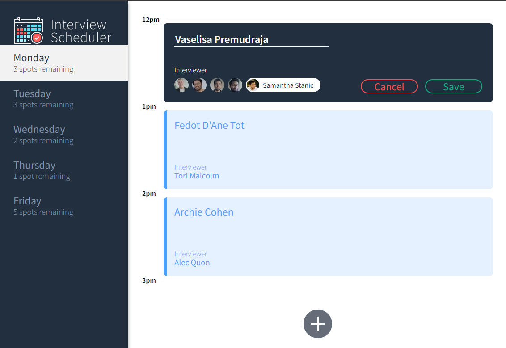
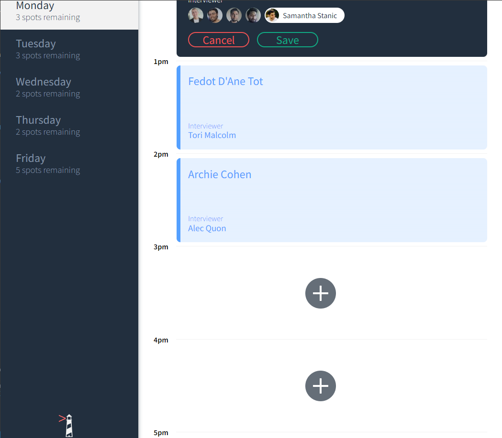
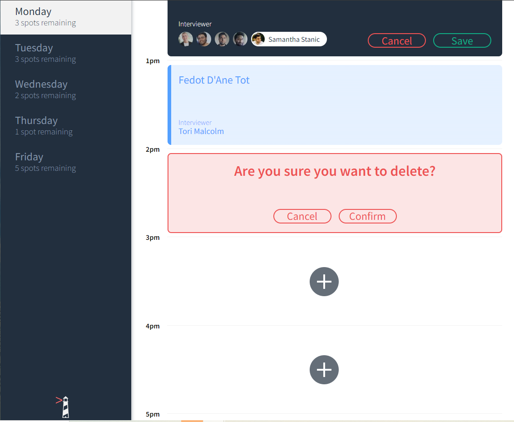

# Interview Scheduler

The Interview Scheduler is a single-page application, allowed users to book, delete, and update appointments for chosen days and times. During the building of the app was using React, HTML, SCSS, JSX, AXIOS, for learn React purposes.

## Final Product





## Get Started
For runing App first you need to run your database ( [`Scheduler-API`](https://github.com/Valera-Neg/scheduler-api) ) server. 


## Setup

Install dependencies with `npm install`.


## Running Webpack Development Server

```sh
npm start
```


## Running Jest Test Framework

```sh
npm test
```

## Running Storybook Visual Testbed

```sh
npm run storybook
```


## Dependencies

- axios
- classname
- normalize css
- react
- react-dom
- react-sctipts
